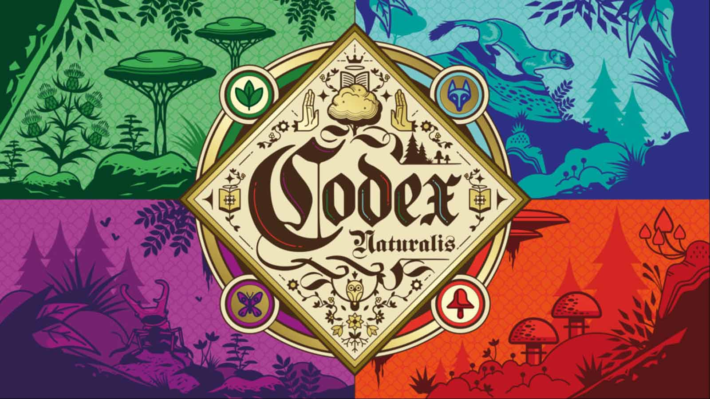

# Ingegneria del Software 2024

## Software Engineering Project - PoliMi 

    <h5> Official deadline: 28/06/2024</h1>
    <h5>A distribuited version of the game CodexNaturalis made by</h5>
    <h5><a href="https://github.com/Slaitroc">Ricci Lorenzo</a></h5>
    <h5><a href="https://github.com/salvoc02">Salvini Christian</a></h5>
    <h5><a href="https://github.com/Krotox">Paoli Matteo</a></h5>
    <h5><a href="https://github.com/AleSarto">Sartori Alessanro</a></h5>

## Features 

| Feature | Implemented  |
| -------- | -------- | 
| Multiple Games   | ✔️   | 
| Resilience to clients disconnections   | ✔️   | 
| Chat   | ✔️   | 
| Socket and RMI   | ✔️   | 
| Complete Rules      | ✔️   | 
| TUI + GUI   | ✔️   | 
| Server disconnections   | ❌   | 

[Requirements PDF](./documents/requirements.pdf)

[RuleBook ENG PDF](./documents/CODEX_Rulebook_EN.pdf)
🔵
[RuleBook IT PDF](./documents/CODEX_Rulebook_IT.pdf)

# How To Use 

