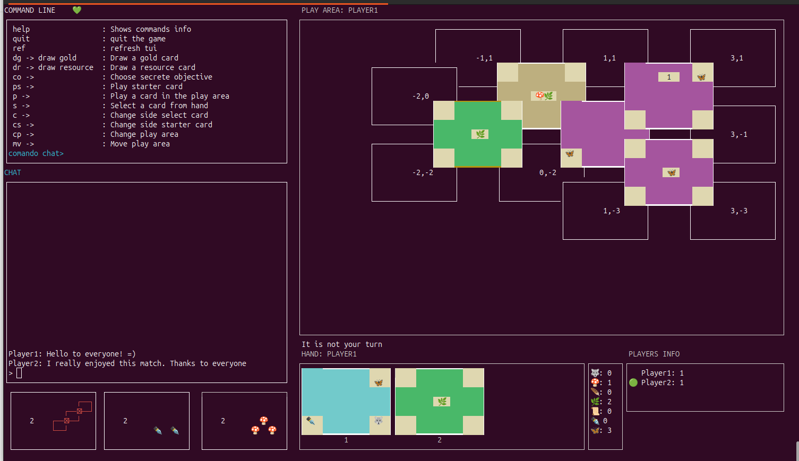
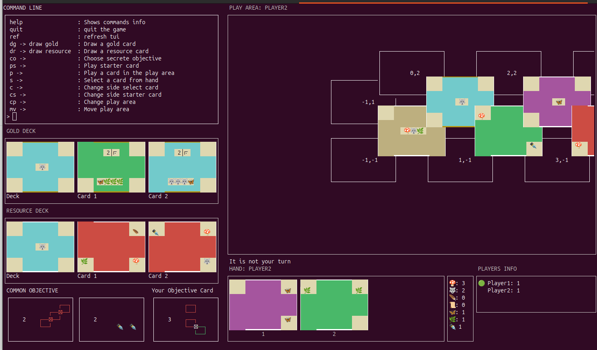
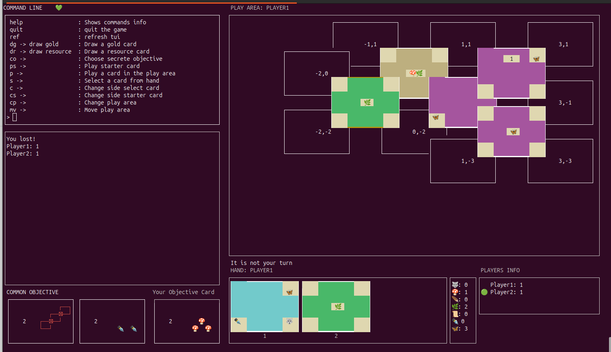
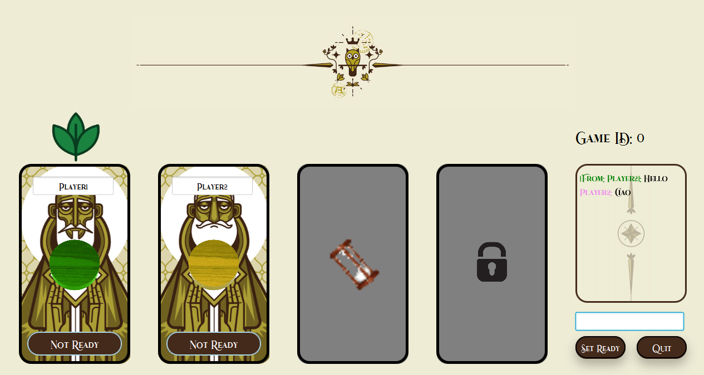
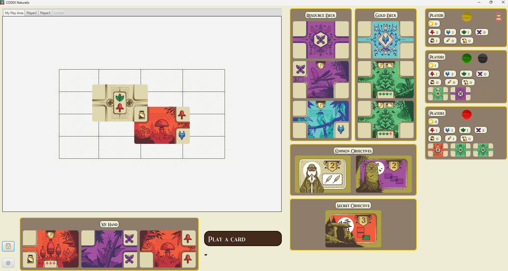
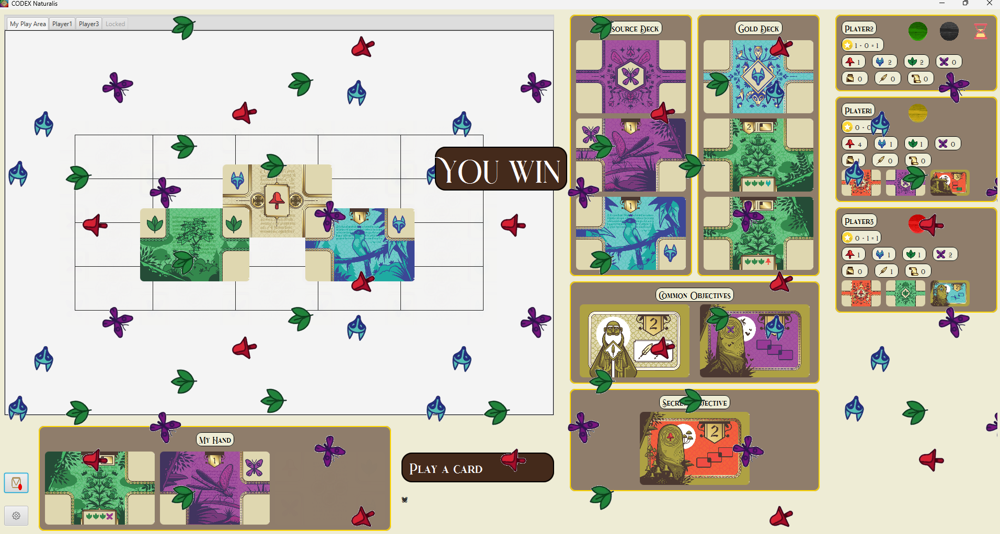

# Ingegneria del Software 2024


## Software Engineering Project - PoliMi

<div align="center">
    <h5> Official deadline: 28/06/2024</h1>
    <h5>A distribuited version of the game CodexNaturalis made by</h5>
    <h5><a href="https://github.com/Slaitroc">Ricci Lorenzo</a></h5>
    <h5><a href="https://github.com/salvoc02">Salvini Christian</a></h5>
    <h5><a href="https://github.com/Krotox">Paoli Matteo</a></h5>
    <h5><a href="https://github.com/AleSarto">Sartori Alessanro</a></h5>
</div>

## Features 

| Feature                              | Implemented |
| ------------------------------------ | ----------- |
| Simplified Rules                     | ✔️          |
| Complete Rules                       | ✔️          |
| Socket and RMI                       | ✔️          |
| TUI + GUI                            | ✔️          |
| Multiple Games                       | ✔️          |
| Resilience to clients disconnections | ✔️          |
| Server disconnections                | ❌          |
| Chat                                 | ✔️          |

[Requirements PDF](./documents/requirements.pdf)

[RuleBook ENG PDF](./documents/CODEX_Rulebook_EN.pdf)
🔵
[RuleBook IT PDF](./documents/CODEX_Rulebook_IT.pdf)

# How To Use 

### Requirements

---

To run the application it is required to have correctly installed:

- JDK21: [Java SE Development Kit 21.0.2](https://www.oracle.com/java/technologies/javase/jdk21-archive-downloads.html).

- JavaFX: [JavaFX - Gluon](https://gluonhq.com/products/javafx).

- Maven: [Apache Maven 3.9.8](https://maven.apache.org/download.cgi).

### 1\. Building the Application .jar File

- Navigate to the project directory.

  On Windows:

  ```powershell
  cd C:\<path-to-repo>\ing-sw-2024-ricci-salvini-paoli-sartori\
  ```

  On Unix:

  ```bash
  cd <path-to-repo>/ing-sw-2024-ricci-salvini-paoli-sartori/
  ```

- To create the application .jar file relative to your OS, execute the following command in the project root.

  ```
  mvn clean install
  ```

- The compiled jar will be found in the
  `ing-sw-2024-ricci-salvini-paoli-sartori/target`
  folder.

### 2\. Running the Application

- To run the jar file, navigate to the directory containing the jar files.

  On Windows:

  ```powershell
  cd C:\<path-to-repo>\ing-sw-2024-ricci-salvini-paoli-sartori\target
  ```

  On Unix:

  ```bash
  cd <path-to-repo>/ing-sw-2024-ricci-salvini-paoli-sartori/target
  ```

From here, type in the following commands:

- Server:
  ```
  java -jar GC31-1.0-SNAPSHOT-server.jar
  ```
  to force the server ip:
  ```
  java -jar GC31-1.0-SNAPSHOT-server.jar <yourIP>
  ```
- Client
  ```
  java -jar GC31-1.0-SNAPSHOT-server.jar
  ```

### Using IntelliJ

1.  In IntelliJ, navigate to `maven -> GC31 -> Lifecycle -> Clean`
2.  Then, go to `maven -> GC31 -> Lifecycle -> Package`
3.  Open Powershell and navigate to the project directory:

    On Windows:

    ```powershell
    cd C:\<path-to-repo>\ing-sw-2024-ricci-salvini-paoli-sartori\target
    ```

4.  From here, run the following commands:
    - `java -jar softeng-gc04-1.0-SNAPSHOT-client.jar` (to run the client)
    - `java -jar softeng-gc04-1.0-SNAPSHOT-server.jar` (to run the server)

Repeat from step 1 each time the code is modified.

# How to Generate Code Coverage 

To generate the Code Coverage with JaCoCo for your project, follow these steps:

- Open CMD and navigate to the project directory:

  On Windows:

  ```powershell
  cd C:\<path-to-repo>\ing-sw-2024-ricci-salvini-paoli-sartori
  ```

  On Unix:

  ```bash
  cd /<path-to-repo>/ing-sw-2024-ricci-salvini-paoli-sartori
  ```

- From here, run the following commands:

  ```
  mvn clean verify
  ```

  The JaCoCo Code Coverage report will be generated in `/<path-to-repo>/ing-sw-2024-ricci-salvini-paoli-sartori/target/site/`

# Game Screenshots

### TUI





### GUI





## Other Features

- Full screen mode responsive

## Credits

This software uses the following open source packages:

- [OpenJfx](https://openjfx.io/)
- [MaterialFX](https://github.com/palexdev/MaterialFX)
- [JUnit](https://junit.org/junit5/)
- [Gson](https://github.com/google/gson)
- [Jansi](https://fusesource.github.io/jansi/)
